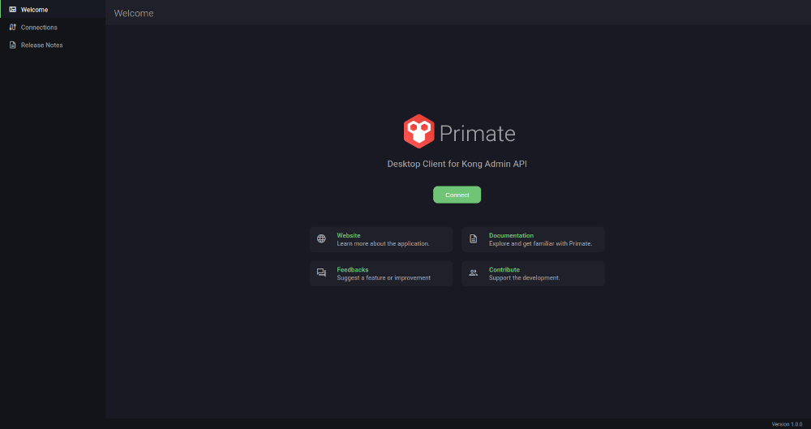
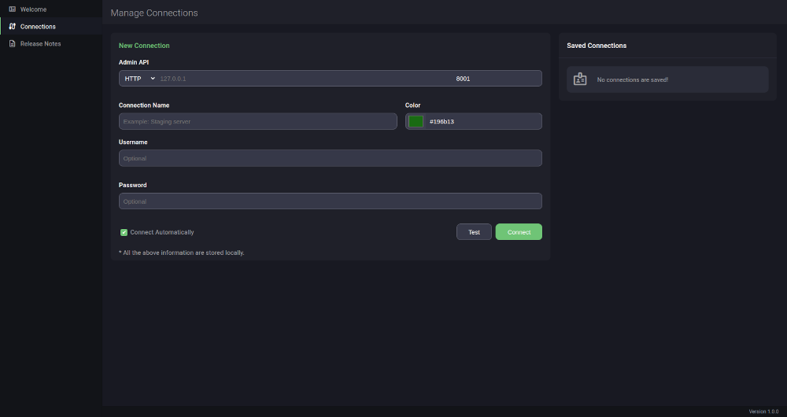

# Initial Setup

Primate, being a regular desktop application, does not require any complex setup procedure.

Now you have installed Primate, all you have to do is open the application. The below screen will be displayed if it is the first time the application is being run.

Click on _Connect_ button to navigate to the _Manage Connections_ screen.

In this screen you will need to provide the necessary information to establish a connection with Kong API Gateway.

* **Protocol** : Choose between HTTP or HTTPS if you have SSL enabled.
* **Host** : The host IP address or host name
* **Port** : The port number. Default 8001.
* **Connection Name** : A name to identify this connection.
* **Color** : A color assigned to this connection as per your choice.&#x20;
* **Username** : Username for authentication if basic authentication is active.
* **Password** : The password for the above username.

Check _Connect Automatically_ if you want Primate to connect automatically to this server next time when you open the application.


Note that this setting will be overwritten if another connection is added with the same option enabled.&#x20;


